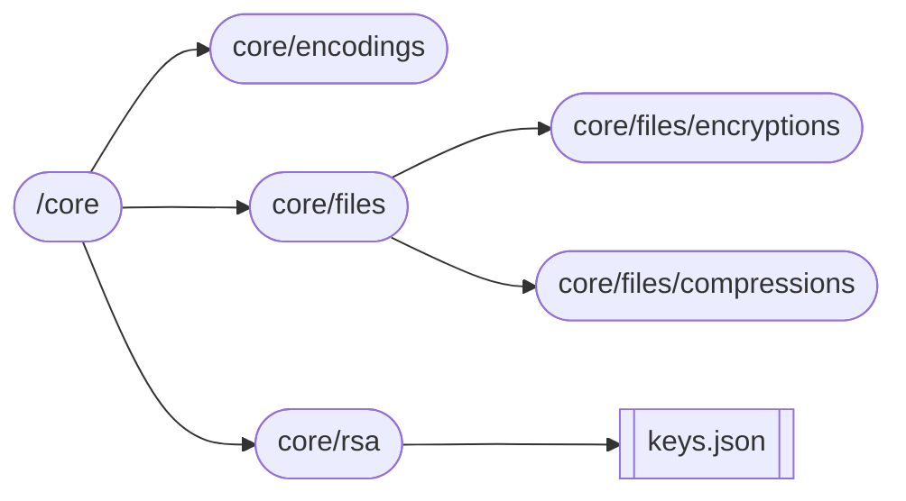

# One Share
This project will focus on creating a cloud storage software using NodeJS. This is primarily be used to create an application that runs on the CLI and on the backend. 

## Core Features
- Cloud Storage. This will be done using the Google Cloud Services API. We will support transferring files to cloud systems.
- Encryption. Before sending the data to the cloud, all files will be encrypted using the RSA algorithm. More details on the design will be discussed later in the encryption subsection.
- Authentication. In order for users to be able to access files associated with a particular cluster, they will need to type in a particular user group-id and associated password. Moreover, after doing so, for security reasons, there will be meta data stored with each authenticated user.

## Cloud Storage
We will be using the Google Cloud Services tool for the actual cloud that will be used. More information can be found in this article for getting everything set up: https://school.geekwall.in/p/WDVg1yrv. Please complete this set-up and meet all requirements before proceeding onto the next sections. 

### Sending Files to Cloud 
There are many examples available on the Google official NodeJS documentation. Here is the official link: https://cloud.google.com/nodejs/docs/reference/storage/latest. We want to be able to support the main following functionality 
    
 - Sending Files
 - Pulling Files (if you have permission)


## RSA Encryption 
We will be using the RSA encryption algorithm. Here is some information about how encryption and the decryption process works: https://cs70.bencuan.me/discrete-math/rsa-cryptography

Things you to need to figure out: 
- Generating large enough primes P and Q.
  - To generate the primes, refer to this link: https://stackoverflow.com/questions/61101371/how-to-generate-random-prime-number
- Calculating the public key.
- Solving for the EGCD to find the private key. 
- Storage locations of private and public key.
- How files will be opened, encrypted, and then saved.
  - You will be opening the file using NodeJS. Then you should write a function called `encryptContents(<string filePath>)`. This will encrypt the file and store it in the appropriate path (core/files/).
- Where the encrypted files will be stored. 
  - We will store the files in a seperate folder called "pubs." It will store the public key and the private key. This will be the format of the file: 
  ```text
  {
    "public-prime": "XXXXXXXXXXXXXXXXX", 
    "public-
    "private": "XXXXXXXXXXXXXXXXXX"
  }
  ```
  - The public key can also be stored with part of the associated file uploaded/user. However, the private key should be kept private.

## Data Compression 
The main algorithm that you will be using is the Huffman coding algorithm. You should be referencing online implementations (don't waste too much time writing it from scratch). Moreover, if possible, you should be trying to parallelize the process of data compression. You should possibly chunk the file into smaller contents and then upload them logarithmatically. You should parallelize the process of uploading somehow. 
### Huffman Coding Algorithm 
Here is an implementation of the Huffman coding algorithm. 

Intuitively, the way that Huffman coding works is that characters with higher frequencies within the string should have less bits to represent them while characters with low frequencies can be represented using a higher number of bits. 

Let's take string MISSISSIPPI RIVER. What we want to first do is figure out the frequency of each letter and then sort them. 

```
I-5 S-4 P-2 R-2 M-1 V-1 E-1 _-1
```

Now, we want to form trees by continously combining the nodes with the lowest two frequencies. Here is the first combine: 
```
                          E_-2 (new node)
                          |   |
I-5 S-4 P-2 R-2 M-1 V-1  E-1 _-1
```

Here is the second: 
```
                MV-2     E_-2 
                |   |    |  |
I-5 S-4 P-2 R-2 M-1 V-1  E-1 _-1
```
Continue doing this until we get a new tree. The root of the tree should contain the total number of characters in the original string. In this example, it will be 17. 

After forming the complete tree, we can get new bit representations for the original letters. Letters are that more frequent have fewer number of bits. Traversing the tree to the left adds a "0" to the bitstring and traversing to the right adds a "1" to the bitstring. One important thing to note is that we need to actually store the mapping that we get later on somewhere so that we are able to decode the original message. 

The algorithm for Huffman coding is on Geeks for Geeks: https://www.geeksforgeeks.org/huffman-coding-greedy-algo-3/. 

Here are some notes:
- Characters are represented through 8 bytes. 
- You will need to append 0's to the file to make it perfectly 8 bytes. To do this, append in the very beginning. Figure this out by parsing through the file, figuring out the size, and then taking mod 8. 
- You need to store the encoding map somewhere.


## Authentication 


## File Structure 

- **encodings**: will contain the compressed version of the files, and the appropriate mapping. Compress versions of files will have the new name `<org. name> + _$compressed.bin`. You will need to store the encoding map.